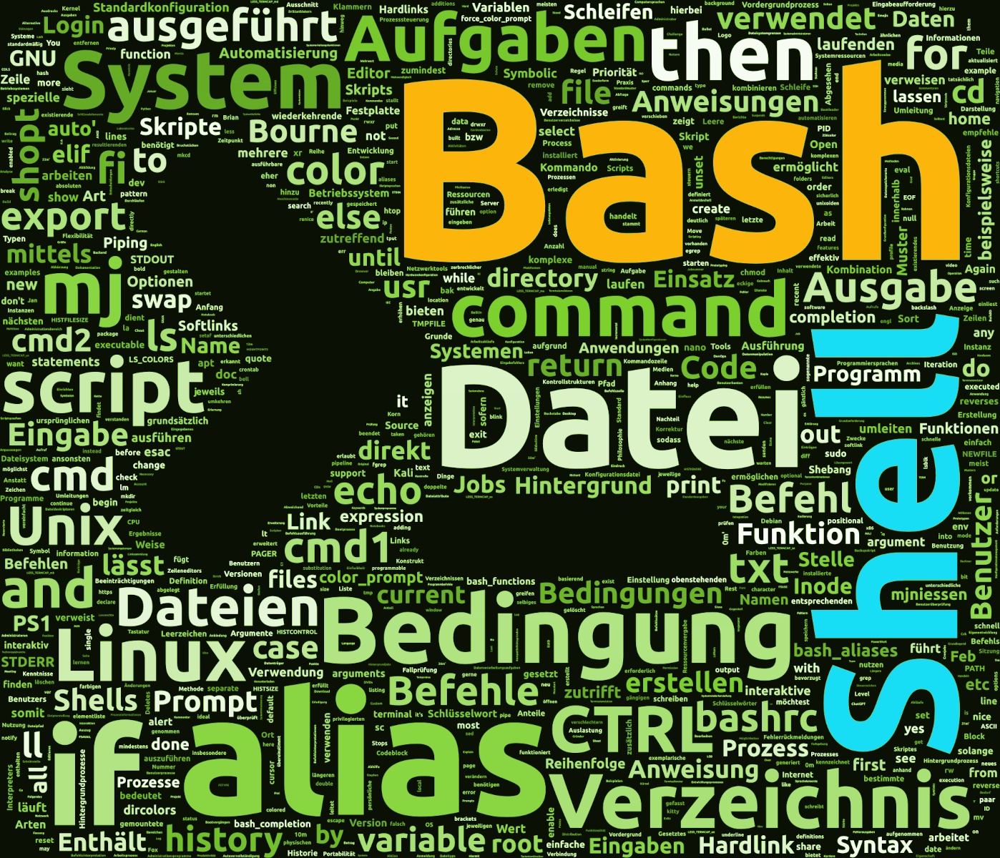

# BASH - Hands-on

Hier findet ihr die erarbeiteten bzw. gezeigten Scripte unseres wöchentlichen Regeltermins.

Die Begleitdokumente als PDF findet ihr [hier](https://hohlhupen.de/bash/).

Um komfortabel das Repository auf euren Rechner zu bekommen, benötigt ihr `git`.
Auf Debian-basierten Systemen lässt sich dieses Tool über folgendes Kommando installieren:

```bash
sudo apt install git
```


In einem Verzeichnis eurer Wahl führt ihr das folgende Kommando aus:

```bash
git clone https://github.com/mjniessen/bash-hands-on.git
```


Aktualisieren, d.h. den von mir hochgeschobenen (`git push`) Stand
herunterzuziehen, lässt sich innerhalb des erstellten Verzeichnisses mit dem
Befehl:

```bash
git pull
```

## Verzeichnis `config`

Die dokumentierte Grundkonfiguration zur direkten Verwendung.

## Verzeichnis `examples`

Ein grosser Teil der besprochenen Beispiele.

## Verzeichnis `templates`

Hier befinden sich die kleinen, besprochenen Grundgerüste, um schnell und
einfach mit eigenen Skripts zu starten.

